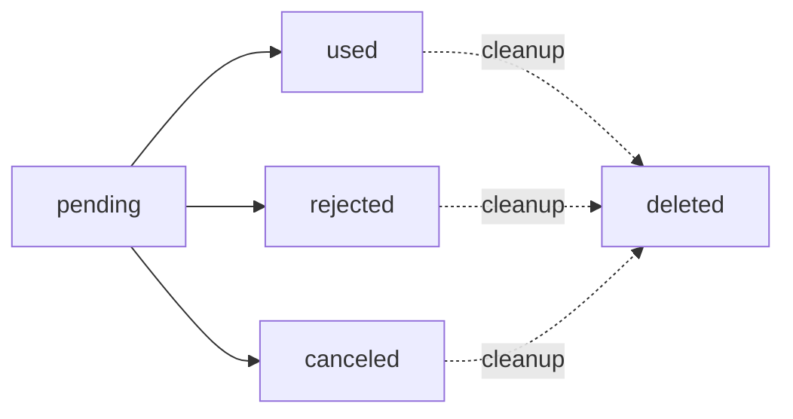

The invite plugin adds two tables to your Better Auth database: `invite` and `inviteUse`.

## Schema Overview

The schema is defined in `src/schema.ts` and follows Better Auth's plugin schema specification.

```ts
export const schema = {
  invite: { /* ... */ },
  inviteUse: { /* ... */ }
} satisfies BetterAuthPluginDBSchema;
```

## Invite Table

The `invite` table stores invitation records.

### Schema Definition

```ts
invite: {
  fields: {
    token: { type: "string", unique: true },
    createdAt: { type: "date" },
    expiresAt: { type: "date", required: true },
    maxUses: { type: "number", required: true },
    createdByUserId: {
      type: "string",
      references: { model: "user", field: "id", onDelete: "set null" },
    },
    redirectToAfterUpgrade: { type: "string", required: false },
    shareInviterName: { type: "boolean", required: true },
    email: { type: "string", required: false },
    role: { type: "string", required: true },
    newAccount: { type: "boolean", required: false },
    status: {
      type: ["pending", "rejected", "canceled", "used"] as const,
      required: true,
    },
  },
}
```

### Fields Reference

<ParamField path="id" type="string" required>
  Primary key (auto-generated).
</ParamField>

<ParamField path="token" type="string" required>
  Unique invitation token. Generated based on `defaultTokenType` configuration.
  
  **Constraint:** Unique across all invitations.
</ParamField>

<ParamField path="createdAt" type="date">
  Timestamp when the invitation was created.
</ParamField>

<ParamField path="expiresAt" type="date" required>
  Timestamp when the invitation expires. Calculated using `invitationTokenExpiresIn` configuration.
</ParamField>

<ParamField path="maxUses" type="number" required>
  Maximum number of times this invitation can be used.
  
  **Default:** 1 for private invites, infinite for public invites.
</ParamField>

<ParamField path="createdByUserId" type="string">
  Foreign key to the `user` table. References the user who created the invitation.
  
  **References:** `user.id`
  
  **On Delete:** SET NULL
</ParamField>

<ParamField path="redirectToAfterUpgrade" type="string">
  Optional URL to redirect to after the user accepts the invitation and upgrades their role.
</ParamField>

<ParamField path="shareInviterName" type="boolean" required>
  Whether to share the inviter's name with the invitee.
  
  **Default:** Controlled by `defaultShareInviterName` configuration.
</ParamField>

<ParamField path="email" type="string">
  Email address for private invitations. When set, only users with this email can accept the invitation.
  
  **Null:** Indicates a public invitation.
</ParamField>

<ParamField path="role" type="string" required>
  The role to assign to the user upon accepting the invitation.
</ParamField>

<ParamField path="newAccount" type="boolean">
  Indicates whether this invitation is for a new account creation. Only applicable to private invitations.
</ParamField>

<ParamField path="status" type="enum" required>
  Current status of the invitation.
  
  **Values:**
  - `pending`: Invitation is active and can be accepted
  - `rejected`: Invitation was rejected by the invitee
  - `canceled`: Invitation was canceled by the inviter
  - `used`: Invitation has reached its maximum uses
</ParamField>

### Invitation Status Lifecycle



<Note>
Invitations can be automatically deleted based on `cleanupInvitesAfterMaxUses` and `cleanupInvitesOnDecision` configuration options.
</Note>

## InviteUse Table

The `inviteUse` table tracks each time an invitation is used.

### Schema Definition

```ts
inviteUse: {
  fields: {
    inviteId: {
      type: "string",
      required: true,
      references: { model: "invite", field: "id", onDelete: "set null" },
    },
    usedAt: { type: "date", required: true },
    usedByUserId: {
      type: "string",
      required: false,
      references: { model: "user", field: "id", onDelete: "set null" },
    },
  },
}
```

### Fields Reference

<ParamField path="id" type="string" required>
  Primary key (auto-generated).
</ParamField>

<ParamField path="inviteId" type="string" required>
  Foreign key to the `invite` table. References the invitation that was used.
  
  **References:** `invite.id`
  
  **On Delete:** SET NULL
</ParamField>

<ParamField path="usedAt" type="date" required>
  Timestamp when the invitation was accepted/used.
</ParamField>

<ParamField path="usedByUserId" type="string">
  Foreign key to the `user` table. References the user who accepted the invitation.
  
  **References:** `user.id`
  
  **On Delete:** SET NULL
</ParamField>

## Relationships

The schema defines several relationships between tables:

### Invite → User (Creator)

```ts
createdByUserId: {
  type: "string",
  references: { model: "user", field: "id", onDelete: "set null" },
}
```

**Type:** Many-to-One

**Description:** Each invite is created by one user. If the user is deleted, the foreign key is set to null.

### InviteUse → Invite

```ts
inviteId: {
  type: "string",
  required: true,
  references: { model: "invite", field: "id", onDelete: "set null" },
}
```

**Type:** Many-to-One

**Description:** Each invite use record belongs to one invitation. Multiple use records can exist for a single invitation if `maxUses > 1`.

### InviteUse → User (Acceptor)

```ts
usedByUserId: {
  type: "string",
  required: false,
  references: { model: "user", field: "id", onDelete: "set null" },
}
```

**Type:** Many-to-One

**Description:** Each invite use record is associated with the user who accepted the invitation.

## Database Migrations

### Initial Migration

Better Auth automatically generates migrations for plugin schemas. After adding the invite plugin, run:

```bash
npx better-auth migrate
```

This creates the `invite` and `inviteUse` tables in your database.

### Example Migration (SQL)

The generated migration will look similar to this:

```sql
CREATE TABLE invite (
  id TEXT PRIMARY KEY,
  token TEXT UNIQUE NOT NULL,
  createdAt DATETIME,
  expiresAt DATETIME NOT NULL,
  maxUses INTEGER NOT NULL,
  createdByUserId TEXT,
  redirectToAfterUpgrade TEXT,
  shareInviterName BOOLEAN NOT NULL,
  email TEXT,
  role TEXT NOT NULL,
  newAccount BOOLEAN,
  status TEXT NOT NULL CHECK(status IN ('pending', 'rejected', 'canceled', 'used')),
  FOREIGN KEY (createdByUserId) REFERENCES user(id) ON DELETE SET NULL
);

CREATE TABLE inviteUse (
  id TEXT PRIMARY KEY,
  inviteId TEXT NOT NULL,
  usedAt DATETIME NOT NULL,
  usedByUserId TEXT,
  FOREIGN KEY (inviteId) REFERENCES invite(id) ON DELETE SET NULL,
  FOREIGN KEY (usedByUserId) REFERENCES user(id) ON DELETE SET NULL
);

CREATE INDEX idx_invite_token ON invite(token);
CREATE INDEX idx_invite_status ON invite(status);
CREATE INDEX idx_invite_email ON invite(email);
CREATE INDEX idx_inviteUse_inviteId ON inviteUse(inviteId);
```

## Custom Schema Extensions

You can extend the schema using the `schema` configuration option:

```ts
invite({
  schema: {
    invite: {
      fields: {
        customMetadata: {
          type: 'string',
          required: false
        },
        organizationId: {
          type: 'string',
          required: false,
          references: {
            model: 'organization',
            field: 'id',
            onDelete: 'cascade'
          }
        }
      }
    }
  }
})
```

After adding custom fields, regenerate migrations:

```bash
npx better-auth migrate
```

## Querying the Schema

### Get Invitations by User

```ts
const invitations = await ctx.context.adapter.findMany({
  model: 'invite',
  where: [
    { field: 'createdByUserId', value: userId }
  ]
});
```

### Get Invitation Usage Count

```ts
const uses = await ctx.context.adapter.findMany({
  model: 'inviteUse',
  where: [
    { field: 'inviteId', value: inviteId }
  ]
});

const usageCount = uses.length;
```

### Check Invitation Status

```ts
const invitation = await ctx.context.adapter.findOne({
  model: 'invite',
  where: [
    { field: 'token', value: token }
  ]
});

if (!invitation) {
  throw new Error('Invitation not found');
}

if (invitation.status !== 'pending') {
  throw new Error('Invitation is no longer valid');
}

if (new Date() > invitation.expiresAt) {
  throw new Error('Invitation has expired');
}
```

## Cleanup Strategies

The plugin implements cleanup logic in `src/utils.ts:161-172`:

```ts
const isLastUse = timesUsed === invitation.maxUses - 1;
const shouldCleanup = isLastUse && options.cleanupInvitesAfterMaxUses;
const shouldCreateInviteUse = !shouldCleanup;

if (shouldCleanup) {
  await adapter.deleteInviteUses(invitation.id);
  await adapter.deleteInvitation(token);
}

if (isLastUse && !options.cleanupInvitesAfterMaxUses) {
  await adapter.updateInvitation(invitation.id, "used");
}
```

### Cleanup on Max Uses

When `cleanupInvitesAfterMaxUses` is enabled:
1. All `inviteUse` records are deleted
2. The `invite` record is deleted
3. No `inviteUse` record is created for the final use

### Cleanup on Decision

When `cleanupInvitesOnDecision` is enabled:
- Invitations with status `rejected` or `canceled` are deleted
- Associated `inviteUse` records are preserved (if any existed before the decision)

<Note>
See [Configuration](/advanced/configuration) for more details on cleanup options.
</Note>
