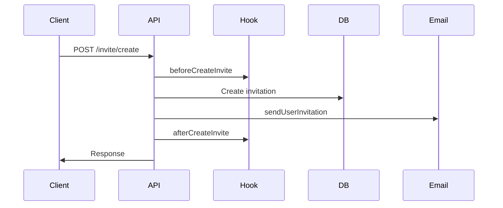
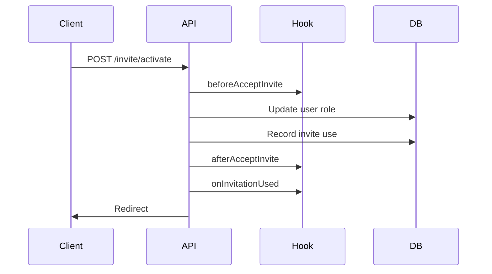

## Overview

The invite plugin provides two ways to respond to invitation events:

- **Hooks** (`inviteHooks`) - Lifecycle hooks that run before and after specific operations
- **Callbacks** (`onInvitationUsed`) - Event handler for completed invitations

Hooks are defined in `src/types.ts` and executed in `src/hooks.ts` and route files.

## Invitation hooks

Configure hooks in your plugin options:

```ts
invite({
  inviteHooks: {
    beforeCreateInvite: async ({ ctx }) => {
      // Runs before creating an invite
    },
    afterCreateInvite: async ({ ctx, invitation }) => {
      // Runs after creating an invite
    },
    beforeAcceptInvite: async ({ ctx, invitedUser }) => {
      // Runs before accepting an invite
    },
    afterAcceptInvite: async ({ ctx, invitation, invitedUser }) => {
      // Runs after accepting an invite
    },
    beforeCancelInvite: async ({ ctx, invitation }) => {
      // Runs before canceling an invite
    },
    afterCancelInvite: async ({ ctx, invitation }) => {
      // Runs after canceling an invite
    },
    beforeRejectInvite: async ({ ctx, invitation }) => {
      // Runs before rejecting an invite
    },
    afterRejectInvite: async ({ ctx, invitation }) => {
      // Runs after rejecting an invite
    },
  },
})
```

## Hook reference

### beforeCreateInvite

Runs before an invitation is created.

```ts
beforeCreateInvite: async ({ ctx }) => {
  console.log("User is creating an invitation:", ctx.context.session.user.id);
}
```

<ResponseField name="ctx" type="GenericEndpointContext">
  The endpoint context containing session, request, and other data.
</ResponseField>

**Example use cases:**
- Audit logging
- Rate limiting
- Custom validation

### afterCreateInvite

Runs after an invitation is successfully created.

```ts
afterCreateInvite: async ({ ctx, invitation }) => {
  console.log("Invitation created:", invitation.token);
  
  // Log to analytics
  await analytics.track({
    userId: ctx.context.session.user.id,
    event: "invitation_created",
    properties: {
      role: invitation.role,
      email: invitation.email,
      inviteType: invitation.email ? "private" : "public",
    },
  });
}
```

<ResponseField name="ctx" type="GenericEndpointContext">
  The endpoint context.
</ResponseField>

<ResponseField name="invitation" type="InviteTypeWithId">
  The created invitation object including:
  - `id` - Database ID
  - `token` - Invitation token
  - `email` - Recipient email (if private invite)
  - `role` - Target role
  - `createdByUserId` - Creator's user ID
  - `expiresAt` - Expiration date
  - `maxUses` - Maximum uses allowed
  - `status` - Invitation status
</ResponseField>

**Example use cases:**
- Analytics tracking
- Webhook notifications
- Database logging

### beforeAcceptInvite

Runs before a user accepts an invitation. Can modify the user object.

```ts
beforeAcceptInvite: async ({ ctx, invitedUser }) => {
  // Modify user data before accepting
  return {
    user: {
      ...invitedUser,
      name: invitedUser.name || "New Member",
    },
  };
}
```

<ResponseField name="ctx" type="GenericEndpointContext">
  The endpoint context.
</ResponseField>

<ResponseField name="invitedUser" type="UserWithRole">
  The user accepting the invitation, including their current role.
</ResponseField>

**Return value:**
- `void` or `Promise<void>` - No modification
- `{ user?: UserWithRole }` - Modified user object (replaces invitedUser in subsequent operations)

**Example use cases:**
- Set default user attributes
- Pre-populate user profile
- Custom data transformation

### afterAcceptInvite

Runs after a user successfully accepts an invitation.

```ts
afterAcceptInvite: async ({ ctx, invitation, invitedUser }) => {
  // Send welcome notification
  await sendNotification({
    to: invitedUser.id,
    message: `Welcome! You're now a ${invitation.role}.`,
  });

  // Update team members list
  await updateTeamCache(invitation.createdByUserId);
}
```

<ResponseField name="ctx" type="GenericEndpointContext">
  The endpoint context.
</ResponseField>

<ResponseField name="invitation" type="InviteTypeWithId">
  The accepted invitation.
</ResponseField>

<ResponseField name="invitedUser" type="UserWithRole">
  The user who accepted, now with their updated role.
</ResponseField>

**Example use cases:**
- Send welcome messages
- Update team membership
- Trigger onboarding flow
- Analytics events

### beforeCancelInvite

Runs before an invitation is canceled.

```ts
beforeCancelInvite: async ({ ctx, invitation }) => {
  // Verify cancellation is allowed
  const timesUsed = await adapter.countInvitationUses(invitation.id);
  if (timesUsed > 0) {
    console.warn("Canceling invitation that has been partially used");
  }
}
```

<ResponseField name="ctx" type="GenericEndpointContext">
  The endpoint context.
</ResponseField>

<ResponseField name="invitation" type="InviteTypeWithId">
  The invitation being canceled.
</ResponseField>

**Example use cases:**
- Audit logging
- Validation
- Notifications

### afterCancelInvite

Runs after an invitation is canceled.

```ts
afterCancelInvite: async ({ ctx, invitation }) => {
  // Notify recipient (if private invite)
  if (invitation.email) {
    await sendEmail({
      to: invitation.email,
      subject: "Invitation canceled",
      html: "Your invitation has been canceled.",
    });
  }

  // Log to audit trail
  await auditLog.create({
    action: "invitation_canceled",
    userId: ctx.context.session.user.id,
    inviteId: invitation.id,
  });
}
```

<ResponseField name="ctx" type="GenericEndpointContext">
  The endpoint context.
</ResponseField>

<ResponseField name="invitation" type="InviteTypeWithId">
  The canceled invitation.
</ResponseField>

**Example use cases:**
- Notify affected users
- Audit logging
- Analytics

### beforeRejectInvite

Runs before an invitation is rejected.

```ts
beforeRejectInvite: async ({ ctx, invitation }) => {
  console.log(`User ${ctx.context.session.user.email} is rejecting invite for ${invitation.role}`);
}
```

<ResponseField name="ctx" type="GenericEndpointContext">
  The endpoint context.
</ResponseField>

<ResponseField name="invitation" type="InviteTypeWithId">
  The invitation being rejected.
</ResponseField>

**Example use cases:**
- Logging
- Analytics
- Pre-rejection validation

### afterRejectInvite

Runs after an invitation is rejected.

```ts
afterRejectInvite: async ({ ctx, invitation }) => {
  // Notify the inviter
  const inviter = await ctx.context.internalAdapter.findUserById(
    invitation.createdByUserId
  );

  if (inviter) {
    await sendEmail({
      to: inviter.email,
      subject: "Invitation declined",
      html: `Your invitation to ${invitation.email} was declined.`,
    });
  }
}
```

<ResponseField name="ctx" type="GenericEndpointContext">
  The endpoint context.
</ResponseField>

<ResponseField name="invitation" type="InviteTypeWithId">
  The rejected invitation.
</ResponseField>

**Example use cases:**
- Notify inviter
- Update invitation statistics
- Analytics tracking

## onInvitationUsed callback

This callback runs after an invitation is successfully used and the user's role has been updated.

```ts
invite({
  onInvitationUsed: async ({ invitedUser, newUser, newAccount }, request) => {
    console.log("Invitation used:", {
      email: newUser.email,
      role: newUser.role,
      wasNewAccount: newAccount,
    });
  },
})
```

<ResponseField name="invitedUser" type="UserWithRole">
  The user before accepting the invitation (with their old role).
</ResponseField>

<ResponseField name="newUser" type="UserWithRole">
  The user after accepting the invitation (with their new role).
</ResponseField>

<ResponseField name="newAccount" type="boolean">
  `true` if this was a new user account, `false` if it was a role upgrade for an existing user.
</ResponseField>

<ResponseField name="request" type="Request">
  The original HTTP request object.
</ResponseField>

### Use cases

<Accordion title="Send welcome email for new users">
  ```ts
  onInvitationUsed: async ({ newUser, newAccount }) => {
    if (newAccount) {
      await sendEmail({
        to: newUser.email,
        subject: "Welcome to our platform!",
        html: `
          <h1>Welcome ${newUser.name}!</h1>
          <p>Your account has been created with the role: ${newUser.role}</p>
        `,
      });
    }
  }
  ```
</Accordion>

<Accordion title="Analytics tracking">
  ```ts
  onInvitationUsed: async ({ invitedUser, newUser, newAccount }) => {
    await analytics.track({
      userId: newUser.id,
      event: newAccount ? "user_registered_via_invite" : "user_role_upgraded",
      properties: {
        previousRole: invitedUser.role,
        newRole: newUser.role,
        email: newUser.email,
      },
    });
  }
  ```
</Accordion>

<Accordion title="Update team statistics">
  ```ts
  onInvitationUsed: async ({ newUser, newAccount }) => {
    if (newAccount) {
      await db.team.increment({
        field: "memberCount",
        by: 1,
      });
    }
    
    await db.roleDistribution.increment({
      where: { role: newUser.role },
      field: "count",
      by: 1,
    });
  }
  ```
</Accordion>

<Accordion title="Trigger onboarding flow">
  ```ts
  onInvitationUsed: async ({ newUser, newAccount }) => {
    if (newAccount) {
      // Create onboarding tasks
      await db.task.createMany({
        data: [
          { userId: newUser.id, title: "Complete your profile" },
          { userId: newUser.id, title: "Set up two-factor auth" },
          { userId: newUser.id, title: "Join your team channels" },
        ],
      });
    }
  }
  ```
</Accordion>

## Hook execution order

Understanding when hooks run:

### Creating an invitation



### Accepting an invitation (logged in)



### Accepting an invitation (new user)

```mermaid
sequenceDiagram
    participant User
    participant Activate
    participant SignUp
    participant Hook
    participant DB

    User->>Activate: GET /invite/{token}
    Activate->>DB: Validate token
    Activate->>User: Set cookie + redirect
    User->>SignUp: POST /sign-up/email
    SignUp->>DB: Create account
    SignUp->>Hook: beforeAcceptInvite
    SignUp->>DB: Update user role
    SignUp->>DB: Record invite use
    SignUp->>Hook: afterAcceptInvite
    SignUp->>Hook: onInvitationUsed
    SignUp->>User: Redirect
```

## Complete example

```ts auth.ts
import { betterAuth } from "better-auth";
import { invite } from "better-auth/plugins";
import { db } from "./db";
import { sendEmail, analytics } from "./services";

export const auth = betterAuth({
  plugins: [
    invite({
      // Hooks configuration
      inviteHooks: {
        beforeCreateInvite: async ({ ctx }) => {
          // Rate limiting
          const recentInvites = await db.invite.count({
            where: {
              createdByUserId: ctx.context.session.user.id,
              createdAt: { gte: new Date(Date.now() - 60 * 60 * 1000) },
            },
          });

          if (recentInvites >= 10) {
            throw new Error("Rate limit exceeded: max 10 invites per hour");
          }
        },

        afterCreateInvite: async ({ ctx, invitation }) => {
          // Analytics
          await analytics.track({
            userId: ctx.context.session.user.id,
            event: "invitation_created",
            properties: {
              role: invitation.role,
              type: invitation.email ? "private" : "public",
            },
          });

          // Audit log
          await db.auditLog.create({
            data: {
              action: "INVITE_CREATED",
              userId: ctx.context.session.user.id,
              metadata: { inviteId: invitation.id, role: invitation.role },
            },
          });
        },

        beforeAcceptInvite: async ({ ctx, invitedUser }) => {
          // Set default user preferences for new members
          if (!invitedUser.name) {
            return {
              user: {
                ...invitedUser,
                name: invitedUser.email.split("@")[0],
              },
            };
          }
        },

        afterAcceptInvite: async ({ ctx, invitation, invitedUser }) => {
          // Send welcome notification
          await db.notification.create({
            data: {
              userId: invitedUser.id,
              type: "WELCOME",
              title: "Welcome to the team!",
              message: `You're now a ${invitation.role}`,
            },
          });

          // Update team stats
          await db.team.update({
            where: { id: invitedUser.teamId },
            data: { memberCount: { increment: 1 } },
          });
        },

        afterCancelInvite: async ({ ctx, invitation }) => {
          // Notify recipient if private invite
          if (invitation.email) {
            await sendEmail({
              to: invitation.email,
              subject: "Invitation canceled",
              html: "Your invitation has been canceled by the sender.",
            });
          }
        },

        afterRejectInvite: async ({ ctx, invitation }) => {
          // Notify inviter
          const inviter = await ctx.context.internalAdapter.findUserById(
            invitation.createdByUserId
          );

          if (inviter) {
            await db.notification.create({
              data: {
                userId: inviter.id,
                type: "INVITE_REJECTED",
                title: "Invitation declined",
                message: `${invitation.email} declined your invitation`,
              },
            });
          }
        },
      },

      // Callback configuration
      onInvitationUsed: async ({ invitedUser, newUser, newAccount }, request) => {
        // Track conversion
        await analytics.track({
          userId: newUser.id,
          event: newAccount ? "user_registered" : "role_upgraded",
          properties: {
            previousRole: invitedUser.role,
            newRole: newUser.role,
            source: "invitation",
          },
        });

        // Start onboarding for new users
        if (newAccount) {
          await db.onboarding.create({
            data: {
              userId: newUser.id,
              status: "pending",
              steps: ["profile", "preferences", "tour"],
            },
          });

          // Send welcome email
          await sendEmail({
            to: newUser.email,
            subject: "Welcome!",
            html: `Welcome ${newUser.name}! Let's get you started.`,
          });
        }
      },

      // Email configuration
      sendUserInvitation: async (data) => {
        await sendEmail({
          to: data.email,
          subject: `You've been invited to join as ${data.role}`,
          html: `<a href="${data.url}">Accept invitation</a>`,
        });
      },
    }),
  ],
});
```

## Error handling in hooks

If a hook throws an error:

- **Before hooks**: The operation is aborted and the error is returned to the client
- **After hooks**: The operation completes, but the error is logged (from `onInvitationUsed` in `src/utils.ts`)

```ts
inviteHooks: {
  beforeCreateInvite: async ({ ctx }) => {
    // This will prevent invite creation
    throw new Error("Cannot create invites right now");
  },
  
  afterCreateInvite: async ({ ctx, invitation }) => {
    try {
      await externalAPI.notify(invitation);
    } catch (error) {
      // Log but don't fail the operation
      console.error("Failed to notify external API:", error);
    }
  },
}
```

## Next steps

<CardGroup cols={2}>
  <Card title="Server setup" icon="server" href="/guides/server-setup">
    Review all configuration options
  </Card>
  <Card title="Email integration" icon="envelope" href="/guides/email-integration">
    Configure email sending for invitations
  </Card>
</CardGroup>