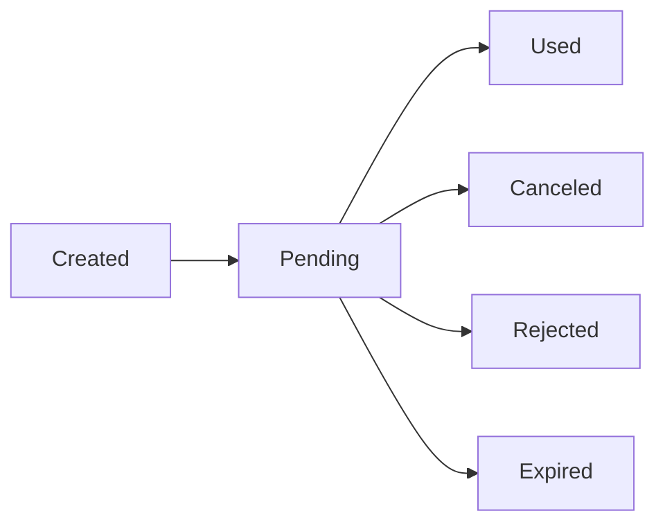

## Get invitation details

Retrieve information about an invitation using its token:

```ts
const invite = await authClient.invite.get({
  token: "invitation-token",
});
```

### Response structure

```json
{
  "status": true,
  "inviter": {
    "email": "admin@example.com",
    "name": "Admin User",
    "image": "https://example.com/avatar.jpg"
  },
  "invitation": {
    "email": "invitee@example.com",
    "createdAt": "2024-03-04T10:00:00.000Z",
    "role": "member",
    "newAccount": true
  }
}
```

### Access control

<Tabs>
  <Tab title="Private invites">
    For invitations with an email address, only the invited user can retrieve details:

    ```ts
    // Only works if logged in as invitee@example.com
    const invite = await authClient.invite.get({
      token: "private-invite-token",
    });
    ```

    If the logged-in user's email doesn't match the invite email, the request fails with `INVALID_TOKEN`.
  </Tab>
  <Tab title="Public invites">
    Anyone can retrieve details for public invitations (without email):

    ```ts
    // Works for anyone, even without authentication
    const invite = await authClient.invite.get({
      token: "public-invite-token",
    });
    ```
  </Tab>
</Tabs>

### Use cases

<Accordion title="Display invitation preview">
  ```tsx
  function InvitePreview({ token }: { token: string }) {
    const [invite, setInvite] = useState(null);
    const [loading, setLoading] = useState(true);

    useEffect(() => {
      authClient.invite.get({ token })
        .then(setInvite)
        .catch(() => alert("Invalid invitation"))
        .finally(() => setLoading(false));
    }, [token]);

    if (loading) return <p>Loading...</p>;
    if (!invite) return <p>Invitation not found</p>;

    return (
      <div>
        <h2>You've been invited!</h2>
        <p>{invite.inviter.name} invited you to join as {invite.invitation.role}</p>
        <p>
          {invite.invitation.newAccount
            ? "Create your account to accept"
            : "Sign in to accept this invitation"}
        </p>
      </div>
    );
  }
  ```
</Accordion>

<Accordion title="Validate invite before showing signup form">
  ```tsx
  async function validateInviteToken(token: string) {
    try {
      const invite = await authClient.invite.get({ token });
      return {
        valid: true,
        role: invite.invitation.role,
        inviterName: invite.inviter.name,
      };
    } catch (error) {
      return { valid: false };
    }
  }
  ```
</Accordion>

## Cancel an invitation

Cancel an invitation you created. Only the user who created the invite can cancel it.

```ts
const result = await authClient.invite.cancel({
  token: "invitation-token",
});

// Result: { status: true, message: "Invite cancelled successfully" }
```

### Requirements

- You must be logged in
- You must be the user who created the invitation
- The invitation must have `pending` status
- The `canCancelInvite` permission check must pass

### Permission checks

The server respects your `canCancelInvite` configuration:

```ts
invite({
  canCancelInvite: async ({ inviterUser, invitation, ctx }) => {
    // Only admins can cancel admin invitations
    if (invitation.role === 'admin' && inviterUser.role !== 'admin') {
      return false;
    }
    return true;
  },
})
```

### Cleanup behavior

Depending on your server configuration:

<Tabs>
  <Tab title="cleanupInvitesOnDecision: false (default)">
    The invitation is marked as `canceled` but remains in the database:

    ```sql
    UPDATE invite SET status = 'canceled' WHERE id = ?;
    ```
  </Tab>
  <Tab title="cleanupInvitesOnDecision: true">
    The invitation and its usage records are deleted:

    ```sql
    DELETE FROM inviteUse WHERE inviteId = ?;
    DELETE FROM invite WHERE token = ?;
    ```
  </Tab>
</Tabs>

### Example: Cancel button

```tsx
function CancelInviteButton({ token }: { token: string }) {
  const [loading, setLoading] = useState(false);

  const handleCancel = async () => {
    if (!confirm("Are you sure you want to cancel this invitation?")) {
      return;
    }

    setLoading(true);
    try {
      await authClient.invite.cancel({ token });
      alert("Invitation cancelled");
    } catch (error) {
      if (error.errorCode === "INSUFFICIENT_PERMISSIONS") {
        alert("You don't have permission to cancel this invite");
      } else if (error.errorCode === "INVALID_TOKEN") {
        alert("This invitation is no longer valid");
      } else {
        alert("Failed to cancel invitation");
      }
    } finally {
      setLoading(false);
    }
  };

  return (
    <button onClick={handleCancel} disabled={loading}>
      {loading ? "Cancelling..." : "Cancel Invitation"}
    </button>
  );
}
```

## Reject an invitation

Reject an invitation sent to you. Only available for private invites, and only the recipient can reject.

```ts
const result = await authClient.invite.reject({
  token: "invitation-token",
});

// Result: { status: true, message: "Invite rejected successfully" }
```

### Requirements

- You must be logged in
- The invitation must be a private invite (with email)
- Your email must match the invitation email
- The invitation must have `pending` status
- The `canRejectInvite` permission check must pass

### Permission checks

```ts
invite({
  canRejectInvite: async ({ inviteeUser, invitation, ctx }) => {
    // Custom logic to control rejections
    return true;
  },
})
```

### Public invites cannot be rejected

Attempting to reject a public invite fails:

```ts
try {
  await authClient.invite.reject({ token: "public-invite-token" });
} catch (error) {
  // error.errorCode === "CANT_REJECT_INVITE"
}
```

### Cleanup behavior

Same as cancel - respects `cleanupInvitesOnDecision` configuration.

### Example: Reject button

```tsx
function RejectInviteButton({ token }: { token: string }) {
  const handleReject = async () => {
    if (!confirm("Are you sure you want to reject this invitation?")) {
      return;
    }

    try {
      await authClient.invite.reject({ token });
      alert("Invitation rejected");
    } catch (error) {
      if (error.errorCode === "CANT_REJECT_INVITE") {
        alert("You cannot reject this invitation");
      } else if (error.errorCode === "INVALID_TOKEN") {
        alert("This invitation is no longer valid");
      } else {
        alert("Failed to reject invitation");
      }
    }
  };

  return <button onClick={handleReject}>Reject Invitation</button>;
}
```

## Invitation lifecycle

Understanding invitation states:



### Status values

<ResponseField name="pending">
  Initial state. Invitation is active and can be accepted.
</ResponseField>

<ResponseField name="used">
  Invitation was successfully accepted and reached max uses.
</ResponseField>

<ResponseField name="canceled">
  Creator cancelled the invitation.
</ResponseField>

<ResponseField name="rejected">
  Recipient rejected the invitation (private invites only).
</ResponseField>

### Status transitions

Only `pending` invitations can be:
- Accepted (activated)
- Canceled by creator
- Rejected by recipient

Once an invitation changes to `used`, `canceled`, or `rejected`, it cannot be used or modified.

## Example: Invitation management dashboard

```tsx
import { useState, useEffect } from "react";
import { authClient } from "@/lib/auth-client";

function InviteManagement() {
  const [invites, setInvites] = useState([]);

  // Note: You'll need to implement a server endpoint to list invites
  // The invite plugin doesn't include a list endpoint by default

  const handleCancel = async (token: string) => {
    try {
      await authClient.invite.cancel({ token });
      // Refresh list
      setInvites(invites.filter(i => i.token !== token));
    } catch (error) {
      alert("Failed to cancel invitation");
    }
  };

  return (
    <div>
      <h2>Pending Invitations</h2>
      <table>
        <thead>
          <tr>
            <th>Email</th>
            <th>Role</th>
            <th>Created</th>
            <th>Uses</th>
            <th>Actions</th>
          </tr>
        </thead>
        <tbody>
          {invites.map(invite => (
            <tr key={invite.token}>
              <td>{invite.email || "(Public invite)"}</td>
              <td>{invite.role}</td>
              <td>{new Date(invite.createdAt).toLocaleDateString()}</td>
              <td>{invite.usedCount} / {invite.maxUses}</td>
              <td>
                <button onClick={() => handleCancel(invite.token)}>
                  Cancel
                </button>
              </td>
            </tr>
          ))}
        </tbody>
      </table>
    </div>
  );
}
```

<Note>
  The invite plugin provides individual invite operations but doesn't include a "list all invites" endpoint. You'll need to query the database directly or create a custom endpoint for this functionality.
</Note>

## Server-side operations

You can also manage invites from your server:

```ts
import { auth } from "./auth";

// Get invite details
const invite = await auth.api.getInvite({
  query: { token: "invitation-token" },
  headers: request.headers,
});

// Cancel invite
const result = await auth.api.cancelInvite({
  body: { token: "invitation-token" },
  headers: request.headers,
});

// Reject invite
const result = await auth.api.rejectInvite({
  body: { token: "invitation-token" },
  headers: request.headers,
});
```

## Cleanup strategies

Choose how to handle completed invitations:

### Keep historical data (default)

```ts
invite({
  cleanupInvitesOnDecision: false,
  cleanupInvitesAfterMaxUses: false,
})
```

Maintains full audit trail of all invitations and their usage.

### Automatic cleanup

```ts
invite({
  cleanupInvitesOnDecision: true, // Delete when canceled/rejected
  cleanupInvitesAfterMaxUses: true, // Delete when fully used
})
```

Reduces database size by removing completed invitations.

### Manual cleanup

Implement a cron job to delete old invitations:

```ts
// Run daily
await db.delete(invite)
  .where(
    and(
      eq(invite.status, 'used'),
      lt(invite.expiresAt, new Date(Date.now() - 30 * 24 * 60 * 60 * 1000))
    )
  );
```

## Error codes

<ResponseField name="INVALID_TOKEN">
  Token doesn't exist, is expired, or invitation status is not `pending`.
</ResponseField>

<ResponseField name="INSUFFICIENT_PERMISSIONS">
  User lacks permission to perform the operation.
</ResponseField>

<ResponseField name="CANT_REJECT_INVITE">
  Either the invite is public, or the user's email doesn't match the invite email.
</ResponseField>

<ResponseField name="INVITER_NOT_FOUND">
  The user who created the invitation no longer exists.
</ResponseField>

## Next steps

<CardGroup cols={2}>
  <Card title="Hooks and callbacks" icon="webhook" href="/guides/hooks-and-callbacks">
    Respond to invitation lifecycle events
  </Card>
  <Card title="Email integration" icon="envelope" href="/guides/email-integration">
    Configure email sending for invitations
  </Card>
</CardGroup>